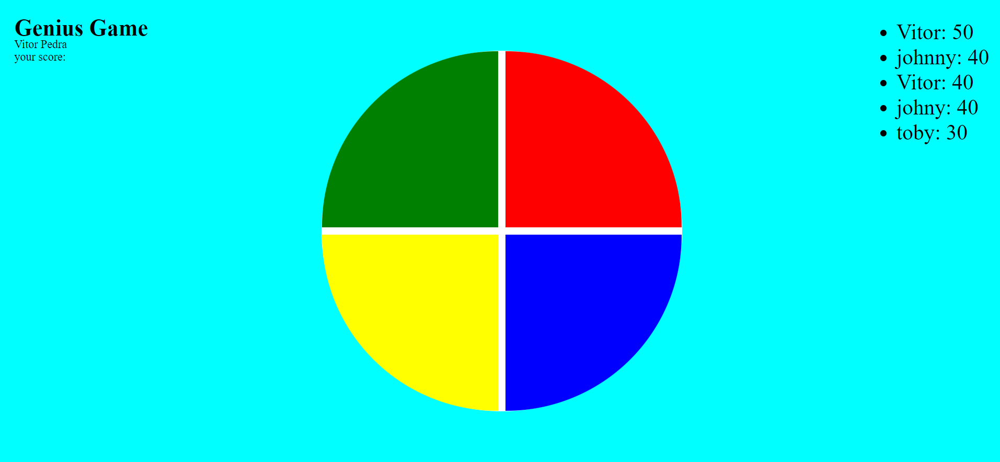

# {VSP}
# Genius Game
## Jogo desenvolvido para plataforma de aprendizado Digital Innovation One





> Genius é um jogo de memória, que aumenta a dificuldade a cada rodade

### Ajustes e melhorias

O projeto foi finalizado


## 💻 Pré-requisitos

 - Não há pre-requisitos para jogar


## ☕ Jogando Genius

Para jogar:

```
Basta inserir seu nome, e prestar atenção nas cores que piscam, memorize a ordem das cores, e quando elas pararem de piscar você deve clicar na mesma sequência,
caso acerte, você ganha dez pontos e uma nova rodada começa, adicionando mais uma cor a sequência.
O Jogo acaba quando erra a ordem, e se tiver feito mais pontos que alguém na lista, seu nome será inserido.
```


## 🤝 Desenvolvido por:

<table>
  <tr>
    <td align="center">
      <a href="#">
        <br>
        <sub>
          <b>Vitor dos Santos Pedra</b>
        </sub>
      </a>
    </td>
  </tr>
</table>


## 🤝 Objetivo:

```
Com Objetivo educacional, a ideia era criar uma aplicação simulando o famoso jogo Genius.
Nesta aplicação tentei utilizar os aprendizados em JS,CSS, HTML e local storage
```


